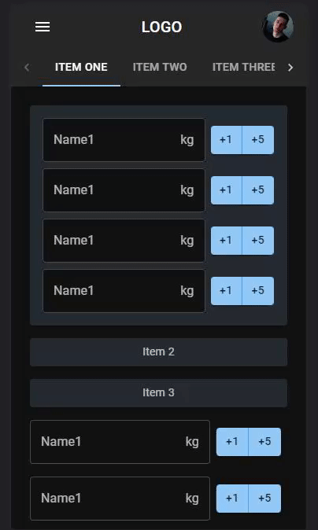

# Life Tracker - UNDER CONSTRUCTION

A Single Page Application built with the [**MERN stack**](https://www.mongodb.com/mern-stack) to help you to track your:
- :white_check_mark: **Workout progress**, the amount of weight you lift each training session per exercise.
- :white_check_mark: **Sleep schedule**, the number of hours of sleep you get every night.
- :white_check_mark: **Personal notes**, your goals, milestones, to-do lists or other things you want to quickly write down.

## Showcase - Proof of concept



## :muscle: Get Started

## :wrench: Playing with the source code, for developers

- Download and install [Git](https://git-scm.com/downloads)
- Download and install [NodeJS](https://nodejs.org/en/download/)
- Download and install [MongoDB](https://www.mongodb.com/try/download/community)

1. Clone the GitHub repository in a folder of your choice and change directories:
    ```bash
    git clone https://github.com/PredatorIWD/Life-Tracker.git
    cd Life-Tracker
    ```
2. Install dependent packages:
    ```bash
    npm i
    ```
3. Start a local React development server at [localhost:3000](localhost:3000) to see live changes in code:
    ```bash
    npm start
    ```
   
## :e-mail: Contact

If you have any questions or suggestions, you can email me at `luka.celebic12@gmail.com`.
